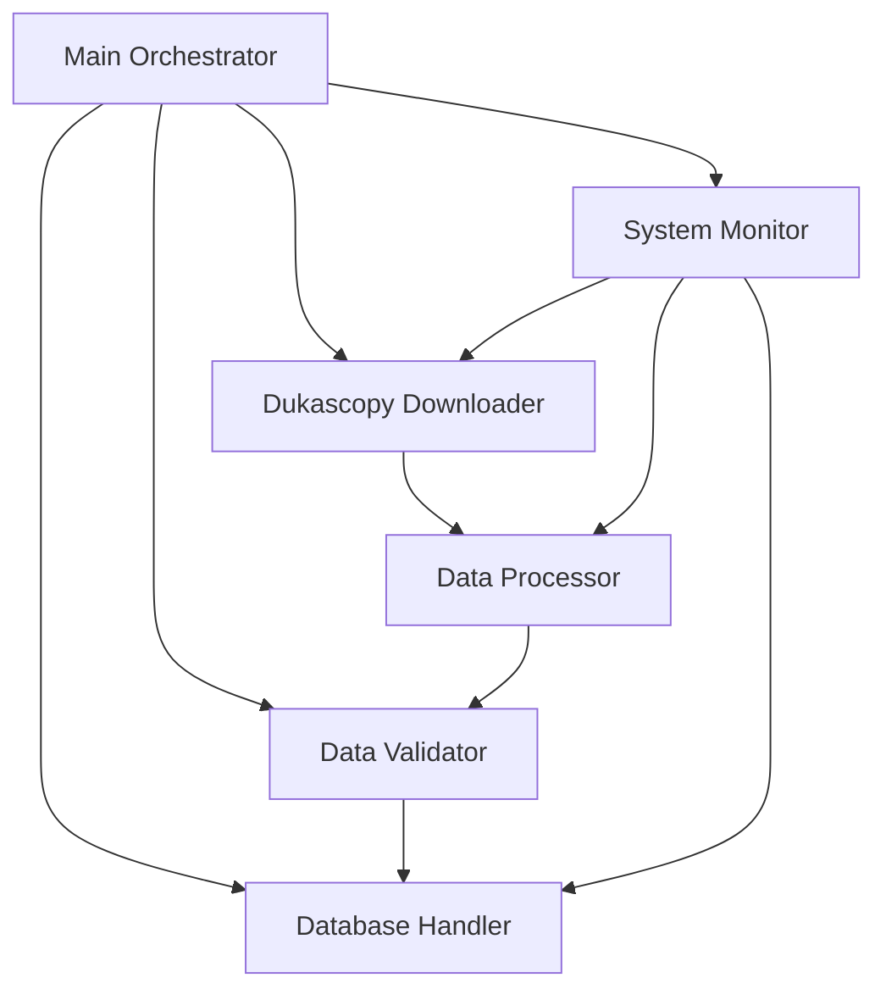

# Trading Data Downloader System Patterns

## System Architecture

### Core Components

### Component Responsibilities

#### Main Orchestrator (main.py)
- Coordinates download operations
- Manages concurrent processing
- Handles error recovery
- Tracks overall progress
- Configures system components

#### Dukascopy Downloader (downloader.py)
- Handles data retrieval
- Implements retry logic
- Manages download cache
- Controls parallel processing
- Decodes tick data

#### Database Handler (db_handler.py)
- Manages database connections
- Handles buffered inserts
- Implements transaction management
- Provides connection pooling
- Ensures data consistency

#### Data Processor (data_processing.py)
- Optimizes tick processing
- Implements numpy operations
- Handles batch processing
- Manages memory efficiency
- Provides data analysis

#### Data Validator (validation.py)
- Validates tick data
- Implements quality checks
- Tracks validation stats
- Manages thresholds
- Reports data issues
- Enforces market rules (bid/ask relationships)
- Handles timestamp validation

#### System Monitor (monitoring.py)
- Tracks performance metrics
- Monitors system health
- Collects statistics
- Manages alerts
- Stores metrics data

## Design Patterns

### Factory Pattern
- Configuration factory for different environments
- Database connection factory
- Validator factory for different instruments

### Strategy Pattern
- Configurable validation strategies
- Flexible retry strategies
- Customizable processing strategies

### Observer Pattern
- Monitoring system implementation
- Progress tracking
- Error notification
- Metric collection

### Repository Pattern
- Database access abstraction
- Tick data storage
- Metrics storage
- Checkpoint management

### Builder Pattern
- Configuration builder
- Validation rule builder
- Query builder

### Validation Patterns
- Bid/Ask Price Validation
  - Bid must be higher than ask price (market maker's spread)
  - Spread calculated as bid-ask difference
  - Excessive spread detection based on percentage
  - Negative price prevention

- Timestamp Validation
  - Base timestamp from hour start
  - Millisecond precision handling
  - Future timestamp prevention
  - Backwards/duplicate detection
  - Gap analysis for data quality

## Key Technical Decisions

### Asynchronous Processing
- Use of asyncio for concurrent operations
- Controlled batch processing
- Non-blocking database operations
- Parallel tick decoding

### Memory Management
- Generator-based processing
- Buffered database operations
- Controlled cache size
- Chunked data handling

### Error Handling
- Centralized error management
- Typed error hierarchy
- Automatic recovery strategies
- Comprehensive logging

### Configuration Management
- Typed configuration schema
- Environment-specific settings
- Validation of all settings
- Dynamic configuration

### Market Data Handling
- Correct bid/ask relationship enforcement
- Precise timestamp management
- Data quality validation rules
- Market-specific validations

## Performance Patterns

### Database Optimization
- Connection pooling
- Buffered bulk inserts
- Efficient transaction management
- Prepared statements

### Processing Optimization
- Numpy-based operations
- Vectorized calculations
- Pre-allocated arrays
- Batch processing

### Memory Optimization
- Streaming processing
- Smart caching
- Resource monitoring
- Automatic cleanup

### Concurrency Control
- Controlled parallelism
- Resource-aware scaling
- Connection management
- Task coordination

## Testing Patterns

### Unit Testing
- Component isolation
- Mock external services
- Validation testing
- Error handling tests

### Integration Testing
- End-to-end workflows
- Database integration
- Concurrent operations
- Recovery scenarios

### Performance Testing
- Load testing
- Memory profiling
- Concurrency testing
- Resource monitoring

### Validation Testing
- Price relationship verification
- Timestamp accuracy checks
- Data quality assertions
- Market rule compliance
